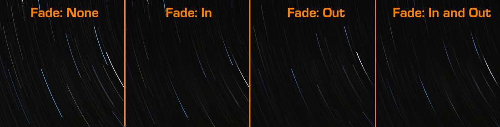

**gimp-startrail-compositor** is a plugin for GIMP which automates the stacking of startrail images, producing either 1 or a set of stacked images.

# Installing the plugin

This plugin requires Python to work. On Linux and OSX this will be preinstalled but for Windows you will need to [install this separately](https://www.python.org/downloads/).

To install the plugin, copy the file `startrail.py` into a plugin folder of your choice. You can either place it in the default locations (see [below](#default-plugin-folders)), or my preference, by adding a plugin folder in my home directory to the plugins.

This last option can be done by going to Preferences :arrow_right: Folders :arrow_right: Plug-Ins.  Here you can add a new folder by clicking the new button (:page_facing_up:) and then navigating to the folder.  You will also be able to see the default locations used on this dialog.

Once done reload GIMP to have the changes take effect.

_The startrail.py script requires execute permissions for it to work.  If the plugin isn't working for you then check this first._

_On linux and macs this can be done by running `chmod +x startrail.py` from the plugins folder._

# Usage

Once installed the menu option can be found under File :arrow_right: Create :arrow_right: Startrail

Once loaded you will be given the following options to set:
* **Light Frames**: the folder containing all your light frames, i.e. the ones you can see the stars in.
* **Use Dark Frames**: Do you want to use dark frame noise reduction
* **Dark Frames**: the folder containing all your dark frames, i.e. the ones you took with the lens cap on.
* **Save intermediate frames**: Checking this will save an image after each frame is layered, allowing you to make a time lapse of the trail building up.
* **Intermediate save directory**: The directory to save the intermediate frames to.  They will be named trail00001.jpg, trail00002.jpg and so on.
* **Live display update *(MUCH slower)***: This will display the frames to the screen live as they are stacked together.  This slows the process down considerably, around 3-4 times slower.  Because of the speed issue, this is disabled by default.
* **Merge all images into a single layer**: This will merge each layer into 1 final image as the stacking progresses.  Disabling this will leave each image in it's own layer. This will add a lot more time to the stack and use more memory but gives more options in post processing.
* **Automatically remove skyglow**: Attempts to reduce the effect of sky glow by creating a copy of each light frame and applying a heavy blur.  This is then subtracted from the light frame before stacking.  The theory being the blur removes the detail leaving only the sky glow which can then be removed.  See this article for detail on how this works: [Creating star trails with automatic sky glow removal](http://fstop138.berrange.com/2016/08/creating-star-trails-with-automatic-sky-glow-removal/).  This will approximately double the time to process each frame.
* **Fade Trails**: this is the option to use when you wish to create a fade effect on the trails (also known as *comet-like effect*). Each frame will get an opacity value computed accordingly to the option of your choice:  
    1. **None**: this is the default option. No fade will be applied to the stack. Every frame will be set with the same opacity value of 100%.
    2. **In**: the opacity of each frame will change from 0% to 100%.
    2. **Out**: the opacity of each frame will change from 100% to 0%.
    2. **In and Out**: the opacity of each frame will change from 0% to 100% and back to 0%.
* **Fade In amount [%]**: default value to 100%. This represent the extent of the **Fade In** option. Let say you choose this value to be 60. Then the first 60% of the trail will be faded in, the last 40% will have maximum opacity value of 100.
* **Fade Out amount [%]**: default value to 100%. This represent the extent of the **Fade Out** option. Let say you choose this value to be 60. Then the first 40% of the trail will have maximum opacity value of 100, the remaining 60% will be faded out.

**PS:** When using the option **Fade In and Out** you need to keep in mind that:  
1. Regardless of the values you input in the **Fade In amount** and **Fade Out amount**, the condition `fade_in_amount + fade_out_amount <= 100` will be implemented: this means the combined fade amounts cannot exceed the length of the trails, assuring that the trails start and end with opacity 0%.
2. The aforementioned condition will be implemented taking **Fade Out Amount** as the control parameter. To understand what this means, consider this example: `Fade In amount: 70` and `Fade Out amount: 80`. The combined fade amount is `70 + 80 = 150 > 100`. Therefore, `fade_in_amount = 100 - fade_out_amount = 20`, meaning that the first 20% of the trails will be faded in, the remaining 80% will be faded out.

This picture illustrates the effect of the fade options.

Currently the plug-in will look for files with the following file extensions:
jpg, jpeg, tiff, tif, bmp and png.

Once all your options are set click ok and wait for the plug-in to do its work.

Once done you will get a new image made from your source images, though this is not saved yet unless you enabled _Save intermediate frames_ where it will be the last frame saved.

This is an example of a timelapse made using intermediate frames:
http://www.youtube.com/watch?v=Qaw72e93JA4
